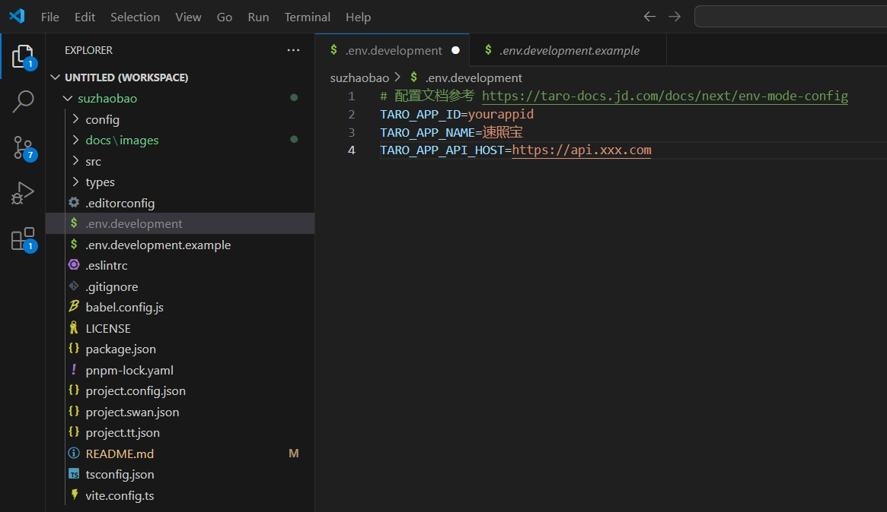

# 速照宝

速照宝证件照换底色微信小程序源码，提供证件照制作、换底色等功能

# 预览

# 扫码下方微信小程序码体验

# ⭐最近更新
- 二次开发源码来自: https://github.com/no1xuan/id-photo-wechat
- 二开内容：采用Taro + Vite + Typescript重写，适配微信基础库版本：3.7.7
------

# 🔧部署

1. 复制`.env.development.example` 为`.env.development`

2. 修改其中`TARO_APP_ID`, `TARO_APP_NAME`, `TARO_APP_API_HOST`的值成你自己的
   

3. 执行`pnpm install` 安装依赖

4. 执行`pnpm build:weapp`进行构建

5. 用微信开发者工具打开dist目录

## 隐私协议

## 客服配置

## 📧其它

您可以通过以下方式联系我:

微信：tinlikecom

